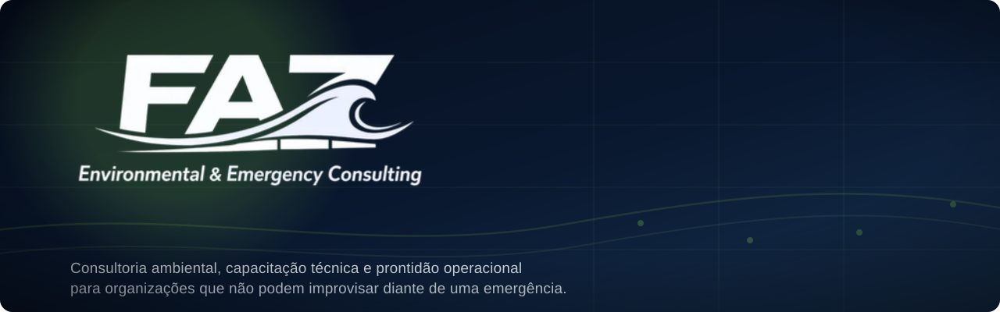
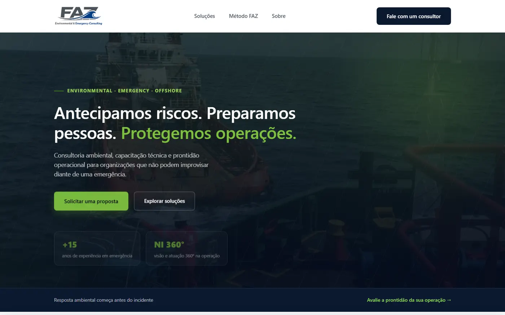
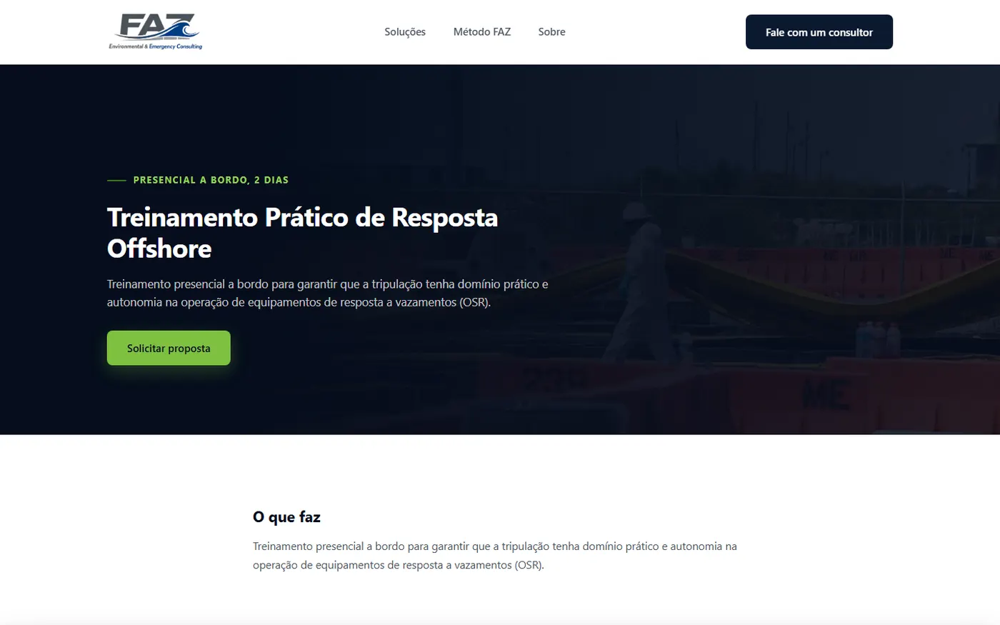
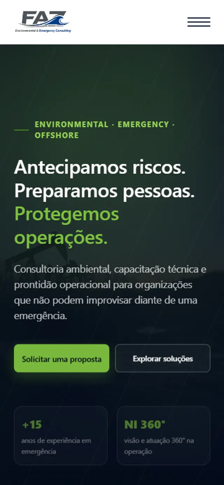

<div align="center">



Site institucional de uma consultoria de meio ambiente e emergência para
operações offshore e industriais: capacitação técnica, planos de emergência
e resposta a incidentes.

[](LICENSE)   

**[Ver o site](https://fazenvironmental.com.br)** · [As telas](#as-telas) · [O que resolve](#o-que-o-projeto-resolve) · [Publicação](#publicação) · [Licença](#licença)

</div>

---

```
apps/
  frontend/   React 19 + Vite, SSR + prerender das rotas em build
  backend/    API Express que recebe leads e serve o frontend já buildado
infra/        docker-compose e provisionamento do túnel Cloudflare
```

## O que o projeto resolve

A FAZ presta consultoria ambiental e treinamento técnico para operações que
não têm margem para improviso diante de uma emergência: derramamento de óleo,
resposta offshore, comando de incidentes. O site é a porta de entrada
comercial. Apresenta as nove frentes de atuação (treinamentos IMO, ICS,
resposta prática offshore, laudos, planos de emergência) e converte o
visitante num lead qualificado.

O formulário de contato valida os dados, grava o lead e dispara notificação
por e-mail, sem depender de nenhum serviço de terceiro para isso. O próprio
backend Express monta e envia o e-mail.

## As telas

<div align="center">

</div>

<table>
<tr>
<td width="50%"><br><sub><b>Serviço</b>: hero com imagem, escopo e CTA de proposta</sub></td>
<td width="50%"><br><sub><b>Mobile</b>: mesmo conteúdo em uma coluna</sub></td>
</tr>
</table>

---

## Frontend

React 19 com Vite. As rotas são pré-renderizadas em build (SSR e um passo de
prerender que grava o HTML de cada página), então o primeiro paint não
depende de JavaScript.

Decisões que sustentam a performance:

* **Prerender de todas as rotas conhecidas**: home, política de privacidade
  e cada página de serviço viram HTML estático no build, servido direto pelo
  Express.
* **Vídeo do hero comprimido e com poster**, para não bloquear o LCP.
* **Splash screen na primeira visita** (uma vez por sessão, via
  `sessionStorage`), com fade e som de sonar, destravado por clique se o
  navegador bloquear autoplay.
* **Scroll reveal** via `IntersectionObserver` num componente `<Reveal>`
  reutilizável, sem biblioteca de animação.
* Ícones de serviço em SVG inline, desenhados no projeto.

```bash
cd apps/frontend
pnpm install
pnpm dev                  # http://localhost:5173
pnpm build                 # tsc -b + vite build (client/SSR) + prerender
```

### Onde mexer

| O que | Arquivo |
| --- | --- |
| Serviços, textos, ícones | `src/data/services.ts`, `src/data/serviceDetails.ts` |
| Cores, tipografia, espaçamento | `src/styles/global.css` |
| Seções da home | `src/components/*Section.tsx` |
| SEO por página | `src/components/Seo.tsx` |

---

## Backend

API Express que serve duas funções: recebe o formulário de contato e o
consentimento de cookies, e serve o frontend já buildado (estático, com
fallback de SPA) a partir do mesmo processo. Não há servidor de frontend
separado em produção.

```bash
cd apps/backend
pnpm install
cp .env.example .env       # preencha as credenciais SMTP
pnpm dev                   # http://localhost:3001
```

### Leads e consentimento

Cada envio do formulário é validado e gravado em `data/leads.json`. Se as
credenciais SMTP estiverem configuradas, uma notificação por e-mail também é
disparada. Sem SMTP configurado, o lead ainda é salvo, só o e-mail é pulado.

O consentimento de cookies (aceite ou recusa do banner) é logado em
`data/consent-logs/`, por data, para efeito de auditoria de LGPD.

---

## Publicação

Site e túnel sobem juntos em containers:

```bash
docker compose -f infra/docker-compose.yml up -d --build
docker compose -f infra/docker-compose.yml ps
docker compose -f infra/docker-compose.yml logs -f app
docker compose -f infra/docker-compose.yml down
```

`restart: unless-stopped` mantém o site no ar: o Docker religa os containers
quando eles quebram e quando o próprio Docker inicia, inclusive depois de
reiniciar a máquina.

O túnel Cloudflare é a única porta de entrada pública. A aplicação não
expõe porta nenhuma para fora do host. Antes do primeiro `up`, rode
`node infra/cloudflare-setup.mjs` para provisionar o túnel dedicado e o DNS
(idempotente, seguro rodar de novo).

Credenciais nunca entram na imagem: chegam por variável de ambiente na
subida, e `.dockerignore`/`.gitignore` excluem todo arquivo de segredo.

| O que | Onde |
| --- | --- |
| Serviços e política de restart | `infra/docker-compose.yml` |
| Provisionamento do túnel e DNS | `infra/cloudflare-setup.mjs` |
| Variáveis da API | `apps/backend/.env` (fora do versionamento) |

---

## Licença

**© 2026 NerdResolve. Todos os direitos reservados.** Veja [LICENSE](LICENSE).

O repositório é público para avaliação técnica e demonstração de portfólio. O
código pode ser lido e estudado; não há licença de uso, cópia ou
redistribuição. A marca **FAZ Environmental & Emergency Consulting** e o
conteúdo institucional pertencem à titular.

---

<div align="center">


**FAZ Environmental & Emergency Consulting**, desenvolvido por [NerdResolve](https://nerdresolve.com)

Quer um site assim? **contact@nerdresolve.com**

</div>
